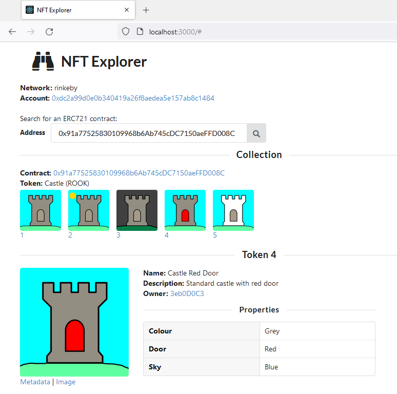

# nft-explorer
Minimalist DApp for viewing Ethereum ERC721 NFT contracts.

Originally created to provide a simple way to visualise the [Castle NFTs](https://github.com/samwarwick/castle-nft) created as a result of the [How to write & deploy an NFT](https://ethereum.org/en/developers/tutorials/how-to-write-and-deploy-an-nft/) Ethereum tutorial.

## Stack

* [React](https://reactjs.org/)
* [Ethers](https://github.com/ethers-io/ethers.js)
* [MetaMask](https://metamask.io/)
* [Semantic UI](https://react.semantic-ui.com/)

## Instructions

1. `npm install`
2. `npm start`
3. http://localhost:3000
4. Connect MetaMask to the Rinkeby testnet and view the sample contract.

Note. The contract response from ethers can be mocked by setting `MOCK_WEB3=true` in the top of [App.js](src/App.js).
